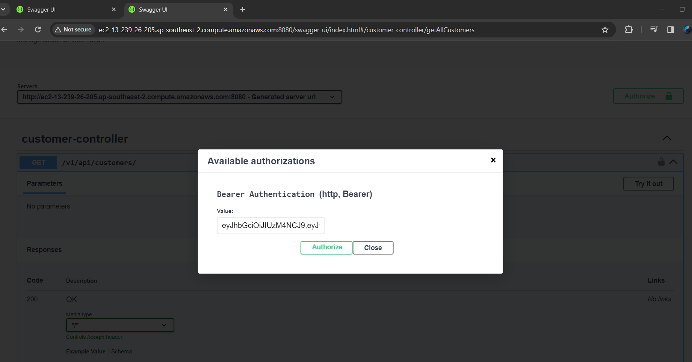
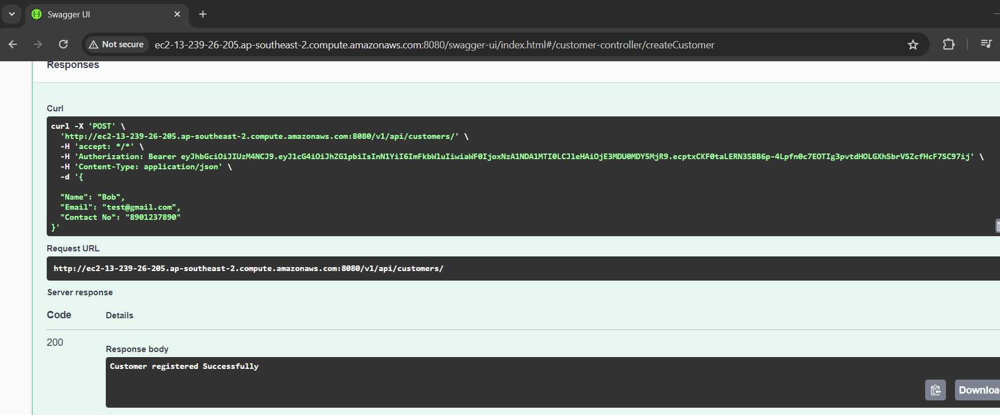

# **PROJECT NAME:** *Customer Service*

## _**Authors**_

Name| Role | Date
----- |------|------
Rajubabu N | Developer | 15-01-2014

## _**CONTENTS OF THIS FILE**_

* [Overview](#overview)
* [Required Software to run Application](#installsoftware)
* [Database](#database)
* [Generate Token](#token)
* [EndPoints](#endpoints)

###  _**Overview**_

Customer service is an application built on Spring Boot Microservice.It is used to create, update, retrieve and delete customer information.Implemented Spring Secuity to access endpoints with JWT token.Using custom methods Authentication and Authorization is handled.

Enabled Swagger API Documentation. Implemented Rest Template to make remake API calls from service.

###  _**Required Software to run Application**_

Verify Java is installed in system by executing command in CMD : java -version .
If JDK is not present then download Adopt Open JDK using link : https://adoptium.net/temurin/releases/

Download any Eclipse to run application .Spring Tool Suite Download link :https://spring.io/tools/

Set 'Path' in Environment variable to bin folder under Java. i.e.: E:\Apps\OpenJDK17U-jdk_x64_windows_hotspot_17.0.9_9\jdk-17.0.9+9\bin

Clone the project from GIT URL:  

Import the Project into Eclipse and start the application

###  _**Databse**_

Properties file is configured with PostgreSQL and H2 databse connection. Download PostgreSQL software to run with PostgreSQL DB.

Note: In Local service tested with PostgreSQL and in AWS tested with H2 Databse.

###  _**Generate Token**_

Microservice is implemented with Spring Security.Bearer token need to be generated using following POST request and used to access the Customer end points:
http://ec2-13-239-26-205.ap-southeast-2.compute.amazonaws.com:8080/auth/generate/token

Users has been created already with below credentials:

Payload to access using 'ADMIN' role : {"userName": "admin","password": "admin"}
Payload to access using 'USER' role : {"userName": "user","password": "user"}

Note: ADMIN can access all the endpoints and USER can access GET endpoints.

###  _**EndPoints**_

Application endpoints can be accessed using Swagger URL:http://ec2-13-239-26-205.ap-southeast-2.compute.amazonaws.com:8080/swagger-ui/index.html#/

Authorize with Bearer token in Swagger.

Method Name |URL | Method | Payload | Remarks
------|------|------ |------------|--------
Create Customer|http://ec2-13-239-26-205.ap-southeast-2.compute.amazonaws.com:8080/v1/api/customers/ | POST | {"Name": "Sam","Email": "abc@gmail.com","Contact No": "1234567890"} | Name and Contact No (10 Digits)
Get All Customers|http://ec2-13-239-26-205.ap-southeast-2.compute.amazonaws.com:8080/v1/api/customerss/ | GET | |
Get Customer By ID|http://ec2-13-239-26-205.ap-southeast-2.compute.amazonaws.com:8080/v1/api/customers/{id} | GET | | Get ID from Get All Customers
Update Customer|http://ec2-13-239-26-205.ap-southeast-2.compute.amazonaws.com:8080/v1/api/customers/ | PUT | {"Id": 100,"Name": "Sam","Email": "abc@gmail.com","Contact No": "1234567890"} | Provide valid ID
Delete Customer|http://ec2-13-239-26-205.ap-southeast-2.compute.amazonaws.com:8080/v1/api/customers/{id} | DELETE | | Provide valid ID

Snapshots:
Passing token in Swagger: 

Create Customer:

